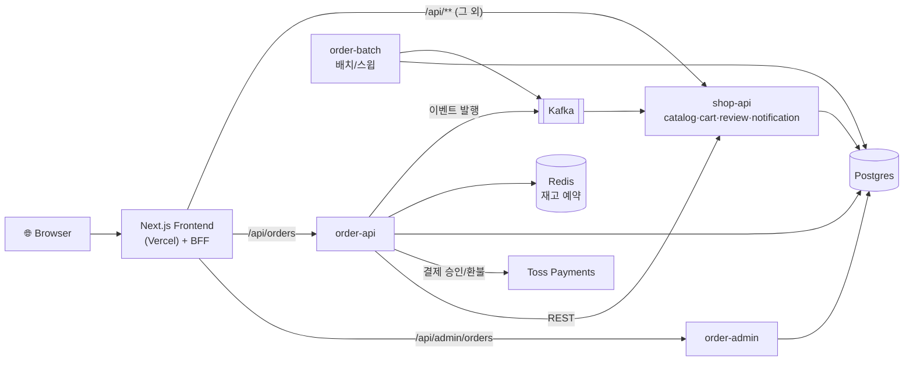

# Mini Commerce

Next.js 프론트엔드 + Spring Boot(헥사고날/모듈러 모놀리스) 백엔드로 구성된 미니 이커머스 서비스입니다. 상품 카탈로그, 장바구니, 주문/결제(Toss Payments), 주문취소/환불, 재고 예약, 알림, 관리자 대시보드를 제공합니다.

> 더 자세한 다이어그램: [시스템 아키텍처 전체 보기 (HTML)](docs/architecture/system-overview.html)

## 아키텍처 한눈에 보기



전체 요청 흐름, 배포 토폴로지(OKE), 관측성 파이프라인은 [docs/architecture/system-overview.html](docs/architecture/system-overview.html)에 상세히 정리되어 있습니다.

## 저장소 구조

```
.
├── frontend/                 # Next.js 앱 (App Router) — 쇼핑몰 + 관리자 + BFF 프록시
├── backend/                  # Spring Boot 멀티모듈 (Gradle) — 상세: backend/README.md
│   ├── shared-core/          # 순수 공통 유틸 (스프링 의존 0)
│   ├── shared-web/           # 공통 웹/보안 컴포넌트 (JWT 검증 필터 등)
│   ├── catalog/               # 상품 카탈로그
│   ├── inventory/             # Redis Lua 기반 재고 예약
│   ├── shop-api/              # 프론트엔드용 BFF 백엔드 (catalog+cart+review+notification)
│   ├── order/                 # 주문 도메인 — 상세: backend/order/README.md
│   │   ├── order-domain/      # 순수 도메인 + 유즈케이스 포트
│   │   ├── order-infra/       # 영속성/결제/카탈로그/이벤트 어댑터
│   │   ├── order-api/         # 고객용 주문 API
│   │   ├── order-admin/       # 관리자용 주문 API
│   │   └── order-batch/       # 재고만료 리퍼 + 미발행 이벤트 스윕 배치
│   └── doc/                   # ARCHITECTURE.md, CONFIGURATION.md, 컨텍스트별 설계 문서
├── docker-compose.yml         # 로컬 인프라(Postgres/Redis/Kafka) + 전체 서비스 + 관측성 스택
├── k8s/                       # Kustomize 매니페스트, ADR, Kafka(Strimzi), 관측성, 시크릿
├── docs/architecture/         # 저장소 전체를 아우르는 HTML 아키텍처 다이어그램
└── ROADMAP.md                 # 트랙별(A~I) 진행상황
```

## 기술 스택

| 레이어 | 기술 |
|---|---|
| Frontend | Next.js(App Router), TypeScript, Supabase Auth |
| Backend | Spring Boot, Spring Modulith(이벤트 아웃박스), 헥사고날 아키텍처, Gradle 멀티모듈 |
| 데이터 | PostgreSQL(Flyway), Redis(재고 예약 Lua Script, ShedLock) |
| 메시징 | Kafka(로컬: KRaft 단일 브로커 / k8s: Strimzi Operator) |
| 결제 | Toss Payments |
| 배포 | Docker Compose(로컬), Kustomize(base+overlays: local/ci/prod) → kind(CI)/Oracle Cloud OKE(운영) |
| 관측성 | OpenTelemetry, Tempo(트레이스), Loki(로그), Prometheus(메트릭), Grafana |
| CI/CD | GitHub Actions — 빌드/테스트 → GHCR 멀티아크 이미지 → kind 스모크 배포 |

자세한 배경은 `ROADMAP.md`의 ADR-007(운영 환경을 Supabase+Upstash+Vercel+OKE로 이전하기로 한 결정)을 참고하세요.

## 로컬 개발 환경

인프라(PostgreSQL, Redis, Kafka)만 띄우기:

```bash
docker compose up -d postgres redis kafka
```

백엔드 전체(모든 서비스)를 컨테이너로 띄우기:

```bash
docker compose up shop-api order-api order-admin order-batch
```

백엔드를 로컬에서 직접 실행(디버깅 시):

```bash
cd backend
./gradlew :shop-api:bootRun
./gradlew :order:order-api:bootRun
```

프론트엔드:

```bash
cd frontend
npm install
npm run dev
```

기본적으로 프론트엔드는 `http://localhost:18080`(shop-api), `http://localhost:18081`(order-api), `http://localhost:18082`(order-admin)를 바라봅니다. 백엔드 서비스별 환경변수 계약은 [backend/doc/CONFIGURATION.md](backend/doc/CONFIGURATION.md)를 참고하세요.

로컬 관측성 UI:

```bash
docker compose up -d tempo loki prometheus grafana
```

Grafana는 `http://localhost:3001`에서 익명 Admin으로 접속 가능하며 Tempo/Loki/Prometheus 데이터소스가 자동 프로비저닝됩니다.

## 문서

- [backend/README.md](backend/README.md) — 백엔드 모듈 구조, 헥사고날/모듈러 모놀리스 설계 원칙, 빌드/실행
- [backend/order/README.md](backend/order/README.md) — 주문 도메인 상세: 헥사고날 레이어, 결제/취소환불 흐름, 이벤트 아웃박스
- [backend/doc/ARCHITECTURE.md](backend/doc/ARCHITECTURE.md) — 도메인 보호 강제 규칙(전체 백엔드 공통)
- [backend/doc/CONFIGURATION.md](backend/doc/CONFIGURATION.md) — 서비스별 환경변수 계약, 프로파일 정책
- [k8s/doc/](k8s/doc/) — 인프라 전환 ADR(kind, Kustomize, Strimzi, ingress-nginx, SOPS, NetworkPolicy, 관측성 등)
- [ROADMAP.md](ROADMAP.md) — 트랙별(버그/보안/커머스 기능/아키텍처/테스트·CI-CD/k8s 전환/관측성/운영) 진행상황
- [docs/architecture/system-overview.html](docs/architecture/system-overview.html) — 전체 시스템 아키텍처 다이어그램(요청 흐름, 배포 토폴로지)
