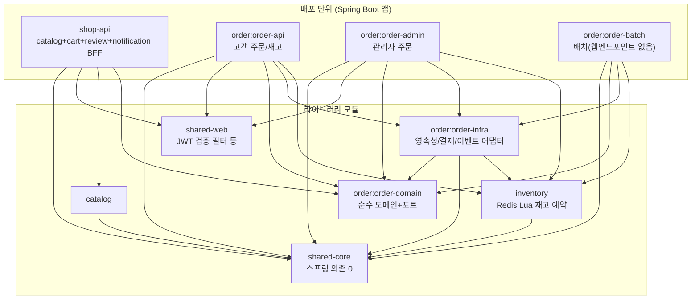

# Backend

Spring Boot 기반 Gradle 멀티모듈 백엔드입니다. **헥사고날 아키텍처(포트&어댑터) + 모듈러 모놀리스(Spring Modulith)**를 목표 패턴으로 하며, 향후 컨텍스트별 MSA 분리를 전제로 설계되어 있습니다. 코드를 수정하기 전에 반드시 [doc/ARCHITECTURE.md](doc/ARCHITECTURE.md)의 강제 규칙을 읽으세요.

## 모듈 구조



| 모듈 | 역할 | 비고 |
|---|---|---|
| `shared-core` | 순수 POJO 공통 유틸/예외 | Spring 의존 0 |
| `shared-web` | JWT 검증 필터(`JwtVerificationFilter`), 관리자 인가 필터(`AdminAuthorizationFilter`) | Supabase JWKS 기반 |
| `catalog` | 상품/옵션 카탈로그 | 레거시 플랫 구조 |
| `inventory` | Redis Lua 스크립트 기반 원자적 재고 예약(reserve/release/confirm/restock), ShedLock | 레거시 플랫 구조 |
| `shop-api` | 프론트엔드용 BFF — catalog + cart/review/notification 잔류, Kafka 주문이벤트 컨슈머 | `minicommerce` DB Flyway 소유 |
| `order:order-domain` | 순수 주문 도메인 모델 + 유즈케이스 포트 | 헥사고날 전환 완료 |
| `order:order-infra` | 주문 영속성/카탈로그 REST/Toss 결제/Kafka 이벤트 아웃박스 어댑터 | 헥사고날 전환 완료 |
| `order:order-api` | 고객용 주문 REST API | `orderdb` Flyway 소유, Kafka 발행 |
| `order:order-admin` | 관리자용 주문 REST API | Flyway `validate`만, Kafka 미사용 |
| `order:order-batch` | 재고만료 리퍼 + 미발행 이벤트 재시도 스윕 | 웹 엔드포인트 없음 |

주문 도메인의 상세 레이어 구조와 유즈케이스 흐름은 **[backend/order/README.md](order/README.md)**를 참고하세요.

## 설계 원칙 (요약)

전체 규칙은 [doc/ARCHITECTURE.md](doc/ARCHITECTURE.md)에 있으며, 핵심만 요약하면:

1. **도메인 순수성**: `domain` 패키지에 `@Entity`, `jakarta.persistence.*`, `org.springframework.*` 금지(Lombok만 허용).
2. **영속성 분리**: 도메인 객체를 JpaRepository에 직접 넘기지 않고, 별도 `*JpaEntity` + Mapper를 경유.
3. **포트 경유**: `application`은 포트 인터페이스에만 의존, 어댑터 구현체 직접 import 금지. 컨트롤러는 `port/in`에만 의존.
4. **단방향 의존**: `adapter → application/domain` 방향만 허용, 역방향 금지.
5. **테이블 소유**: 컨텍스트는 자기 테이블만 소유, 타 컨텍스트 Repository/Entity/테이블 직접 접근·조인 금지. 크로스 컨텍스트 통보는 도메인 이벤트(Spring Modulith 아웃박스)로만.
6. **MSA 전환 대비**: DB당 마이그레이션 소유 앱 단일화, 컨테이너 기동 순서 하드 의존 금지, 컨텍스트 간 단일 트랜잭션 동시 커밋 금지(사가/보상 패턴 사용).

컨텍스트별 전환 현황(order는 헥사고날 완료, catalog/inventory는 모듈 분리만 완료, cart/review/notification은 shop-api 잔류)은 [doc/architecture/](doc/architecture/) 하위 문서에 정리되어 있습니다.

## 인증 구조

`shared-web`의 공통 필터를 각 BOOT 앱(`shop-api`/`order-api`/`order-admin`)이 자신의 `global/WebConfig.java`에서 재사용합니다.

- `JwtVerificationFilter` — Supabase JWKS로 서명 검증(env: `SUPABASE_JWKS_URL`), 프론트엔드 BFF가 첨부하는 `BFF_SECRET_KEY`(env: `BFF_SECRET_KEY`)도 함께 확인.
- `AdminAuthorizationFilter` — `/api/admin/**` 경로에 등록.
- `order-batch`는 웹 API가 없어 이 설정이 적용되지 않습니다.

## 이벤트 아웃박스 (Spring Modulith)

`shop-api`, `order:order-api`, `order:order-batch` 세 BOOT 앱이 `spring-modulith-starter-core/jpa/events-kafka`를 사용합니다. 트랜잭션 내에서 발행된 도메인 이벤트는 `event_publication` 테이블(아웃박스)에 기록된 뒤 커밋 후 Kafka로 외부화됩니다. 미발행 이벤트는 `order-batch`의 `IncompleteEventSweeper`가 5분 주기로 재시도합니다(ShedLock으로 다중 replica 중복 실행 방지). 상세 흐름은 [backend/order/README.md](order/README.md#이벤트-아웃박스--kafka-라우팅)를 참고하세요.

## 로컬 실행

인프라만:

```bash
docker compose up -d postgres redis kafka
```

전체 서비스(컨테이너):

```bash
docker compose up shop-api order-api order-admin order-batch
```

개별 서비스를 로컬에서 직접 구동(디버깅):

```bash
./gradlew :shop-api:bootRun
./gradlew :order:order-api:bootRun
./gradlew :order:order-admin:bootRun
./gradlew :order:order-batch:bootRun
```

빌드/테스트:

```bash
./gradlew build          # 전체 모듈 빌드 + 테스트
./gradlew :order:order-domain:test   # 특정 모듈만
```

## 설정

모든 서비스는 12-factor 원칙을 따라 환경변수로 설정을 주입받습니다(`application.yml`은 `${ENV_VAR:local-default}` 형태). `k8s`/`prod` 같은 별도 프로파일은 두지 않으며, 유일한 프로파일 `local`은 `shop-api`의 시드 데이터 on/off 스위치입니다. 서비스별 필수 환경변수 계약표는 **[doc/CONFIGURATION.md](doc/CONFIGURATION.md)**를 참고하세요.

## 배포

각 BOOT 앱은 독립 컨테이너 이미지로 빌드되어 k8s(`k8s/base/*.yaml`)에 배포됩니다. Ingress 라우팅은 `/api/admin/orders`→order-admin, `/api/orders`→order-api, 그 외 `/api/**`→shop-api이며 `/internal/**`은 NetworkPolicy로 서비스 간 전용 트래픽만 허용됩니다. 전체 배포 토폴로지는 [../docs/architecture/system-overview.html](../docs/architecture/system-overview.html)을 참고하세요.
