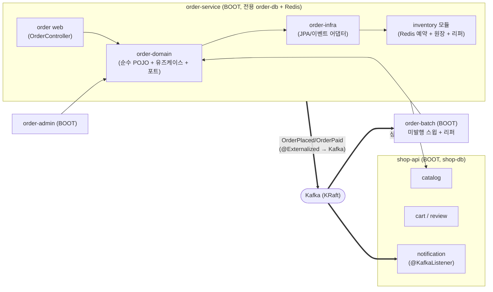
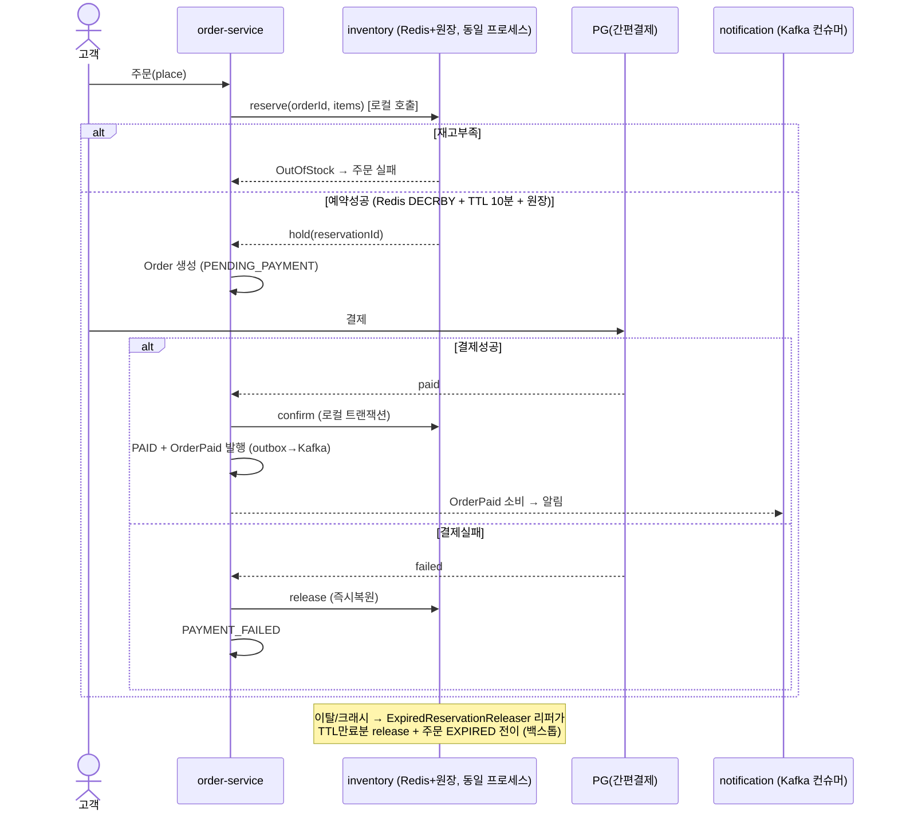
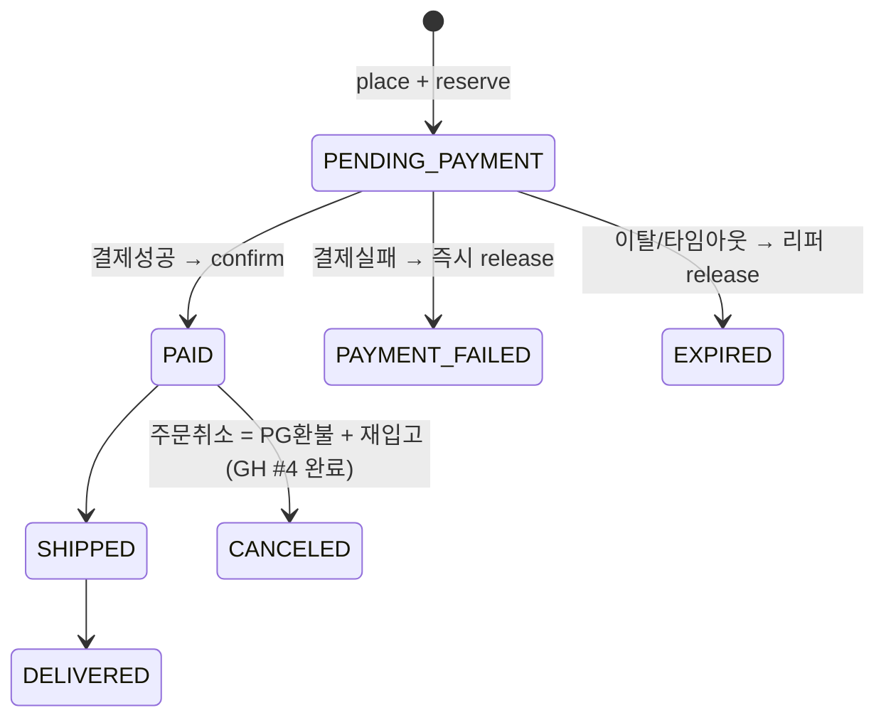

# `order` 컨텍스트

**상태**: 헥사고날 도메인 순수화(Phase 0–1) + 모듈 분리(Phase 2–5) 완료. 이후 **MSA 서비스그룹(b)
전략으로 방향 전환**(2026-07-02) — order+inventory를 한 서비스+한 DB로 자립시키고 이벤트를 Kafka로
externalize 한다. 체크리스트/현황은
[GitHub Issue #2](https://github.com/polypola-dev/mini-commerce/issues/2)
"order MSA 전환 (Kafka + 서비스그룹 + 전용 DB)" 참조(구 Issue #1은 토대 완료 후 close).
결정 배경은 Obsidian **ADR-005**("order MSA 전환 — 서비스그룹(b) + Kafka + 하이브리드 재고 사가",
ADR-004의 단일 DB 결정을 부분 supersede).

## 현재 패키지 구조 (모듈 경계 포함)

> **현 단계: S3 취소 모델 정비(3a) 완료, 물리 분리(BOOT/DB/웹계층 이관) 착수 전** — order/inventory는
> 아직 `shop-api` 프로세스에 함께 있고, order 웹 계층(`OrderController`)도 shop-api에 잔류(3b 대상).
> order-infra는 catalog를 **REST로만** 호출하도록 전환됐다(S2, 컴파일 의존 제거). order 이벤트는
> Kafka로 externalize 된다(S1). `EXPIRED` 상태와 리퍼→order 이벤트 배선이 추가됐다(3a). 아래는
> **지금 실제 코드** 기준이며, 스테이지가 진행될 때마다 이 트리를 갱신한다(목표형으로 미리 고치지 않는다).

```
order/order-domain/          (Gradle 모듈 — jakarta.persistence·spring-web 의존 0)
├── domain/                 순수 POJO. 기술 의존 0.
│   ├── Order(표시 전용 orderNumber 포함 — GH #19), OrderLine, OrderLineDraft, OrderStatus(EXPIRED 포함)
│   └── exception/          OrderNotFoundException, OrderErrorCode
├── application/             유즈케이스 구현 + 포트 (spring-context/spring-tx만 의존)
│   ├── OrderService, OrderPersistenceService, PlaceOrderCommand
│   ├── port/in/             PlaceOrderUseCase, CompletePaymentUseCase, GetOrdersUseCase, ExpireOrderUseCase
│   └── port/out/            OrderRepository, InventoryPort, ProductQueryPort, OrderEventPublisher,
│                            OrderNumberPort(표시 전용 주문번호 채번 — GH #19)
└── (이벤트 record는 order-events로 이동 — GH #5)

order/order-events/          (Gradle 모듈 — 의존성 0. Kafka 이벤트 계약 전용)
└── OrderPlacedEvent, OrderPaidEvent, OrderCanceledEvent  (order 컨텍스트가 소유,
                              발행측 order-infra와 구독측 shop-api가 이 모듈만 공유. 표시 전용
                              orderNumber 필드 포함 — 알림 메시지가 UUID 대신 이 번호를 쓴다, GH #19)

order/order-infra/           (Gradle 모듈 — order-domain, inventory에 의존. catalog는 모듈 의존 없이 REST로만 호출)
├── adapter/out/persistence/ OrderJpaEntity(order_number 컬럼 포함), OrderLineJpaEntity, OrderPersistenceMapper,
│                            OrderPersistenceAdapter, OrderNumberAdapter(OrderNumberPort 구현 — 일별 리셋
│                            채번, order_number_sequences 카운터 행을 비관적 락으로 증가, GH #19),
│                            OrderNumberSequenceJpaEntity, OrderNumberSequenceInitializer(REQUIRES_NEW)
├── adapter/out/catalog/     CatalogProductAdapter (ProductQueryPort 구현, RestClient로 catalog의
│                            /internal/products/* 호출 — S2, 컴파일 의존 없음)
├── adapter/out/inventory/   InventoryAdapter (InventoryPort 구현, inventory의 InventoryService 공개 API 경유)
├── adapter/in/event/        ReservationExpiredEventListener (@ApplicationModuleListener, inventory의
│                            ReservationExpiredEvent 수신 → ExpireOrderUseCase 호출 — 3a)
└── adapter/out/event/       SpringOrderEventAdapter

order/order-admin/           (Gradle 모듈 — BOOT 스켈레톤만, 아직 실사용 컨트롤러 없음)
order/order-batch/           (Gradle 모듈 — BOOT 스켈레톤만, 아직 Job 없음)

catalog/                     (Gradle 모듈, shop-api에 상주)
└── ProductInternalController /internal/products/{id}, /internal/products/options/{id} — order 전용
                              내부 API. 스토어프론트용 ProductController와 별개(S2)

shop-api/                    (BOOT 모듈 — order 쪽은 order-events(이벤트 계약)에만 의존,
                               order 전용이 아닌 범용 API 게이트웨이.
                               cart/review/notification의 웹 계층도 여기 있음)
├── EventExternalizationConfig  order 이벤트를 order.placed/order.paid 토픽으로 라우팅(S1)
├── notification/OrderEventKafkaConsumer  @KafkaListener, (orderId,type) 멱등 가드(S1)
└── adapter/in/web/          OrderController, OrderAdminController, DTO
```

## MSA 목표 구조 (서비스그룹 (b) 전략)

order를 독립 배포 서비스로 자립시키되, **트랜잭션 고응집인 inventory와 한 서비스+한 DB로 묶는다**
(reserve/confirm/release를 로컬 트랜잭션으로 유지 → 분산 사가 회피). inventory는 별도 Gradle
모듈로 유지(ArchUnit 경계 강제)하되 order-service에 **함께 배포**한다 — 모듈 ≠ 배포단위라, 후속
(c) 완전분리 추출이 싸진다.



**DB 토폴로지**: `order-db`(orders, order_lines, inventory 예약원장) + `shop-db`(catalog, cart,
review, notification) 2분할로 시작. catalog는 order의 동기 read dependency(가격/상품명은 이미 주문
라인에 스냅샷). 4-DB 완전분리는 강제하지 않으며 후속 (c) 에픽에서 필요 시 확장.

## 주문 사가 흐름



## 주문 상태 전이



> **취소 모델 주의**: 간편결제로 `PENDING_PAYMENT` 창이 수 초라 그 구간의 사용자 취소는 사실상
> 무의미하다. 결제 전 복원은 `PaymentFailed`(자동, 이미 관리자 `updateStatus` 범용 경로로 도달
> 가능해 전용 도메인 메서드는 추가하지 않음) + 리퍼(이탈)로 처리하고, 사용자가 체감하는
> "주문취소"는 대부분 **결제 후(PAID→CANCELED)** 로 PG 환불 + 확정재고 재입고가 필요한 **별도
> 에픽**이다(아직 미착수). **`EXPIRED` 상태·`Order.markExpired()`·리퍼→order 이벤트 배선은 완료**(3a,
> 2026-07-03) — `ExpiredReservationReleaser`가 재고 해제 성공 시 `ReservationExpiredEvent`(inventory
> 소유)를 발행하고, order-infra의 `ReservationExpiredEventListener`(`@ApplicationModuleListener`,
> in-process — order/inventory는 서비스그룹(b) 전략상 영원히 같은 프로세스라 Kafka 불필요)가 받아
> `ExpireOrderUseCase`로 주문을 `EXPIRED`로 전이한다. docker-compose 환경에서 실제 리퍼 스케줄
> 실행→DB/Redis 반영까지 e2e로 검증함.

## 완료된 사항 (Phase 0–1)

- 안전망: `OrderPersistenceAdapterTest`(@DataJpaTest) — 저장/조회 라운드트립, 고객별 조회,
  상태변경 후 재저장 라인보존(merge/orphan 가드).
- `Order`/`OrderLine`을 순수 POJO화, `reconstitute()` 팩토리로 영속성 복원.
- `OrderJpaEntity`/`OrderLineJpaEntity` + `OrderPersistenceMapper` 신설, 도메인↔엔티티 매핑 분리.
- application 계층의 기술 예외(`jakarta.persistence.EntityNotFoundException`) 제거,
  도메인 예외(`OrderNotFoundException`, `BusinessException` 기반)로 교체.
- Modularity.verify() 통과 — global↔order 순환은 공통 베이스 예외로 해소, order→global 단방향 유지.

## 남은 계획 (MSA 전환 S1–S4)

멀티모듈 골격(shared 분리, catalog/inventory 라이브러리화, order-domain/infra 분리)과 order-domain
경계 ArchUnit 룰은 완료(구 Issue #1 토대). 이후 MSA 전환은 아래 4단계로 진행하며 **상세 체크박스는
[GitHub Issue #2](https://github.com/polypola-dev/mini-commerce/issues/2)를 단일 소스**로 유지한다
(이 문서에 복제하지 않음).

- **S1 ✅** — Kafka(KRaft) 인프라 + `OrderPlaced`/`OrderPaid` externalization, notification을 `@KafkaListener`(멱등)로. docker-compose e2e로 발행→소비→알림생성+멱등 확인.
- **S2 ✅** — catalog를 order의 REST read dependency로 정리(shop-api 잔류). `CatalogProductAdapter`가 `RestClient`로 catalog `/internal/products/*` 호출, order-infra의 catalog 모듈 컴파일 의존 제거. 단위테스트(MockRestServiceServer) + 실행 중인 앱에 curl로 200/404 왕복 확인.
- **S3 진행 중** — 3a(취소 모델 정비: `EXPIRED` 추가, 리퍼→order 이벤트 배선) ✅ 완료(2026-07-03).
  3b(order-service(order+inventory) BOOT 분리 + 전용 order-db + 웹 계층/필터 배선 이관) 착수 전.
- **S4** — order-admin/order-batch 배포 분리, order-batch = 미발행 이벤트 스윕 + 재고 리퍼.

## 크로스 컨텍스트 접근

- `catalog`: `ProductQueryPort` → **동기 REST 어댑터**(`CatalogProductAdapter` → `RestClient` →
  catalog의 `/internal/products/*`)를 통해서만(S2 완료). 가격/상품명은 주문 시점에 주문 라인으로
  스냅샷 복사한다. `catalog`의 Repository/도메인 클래스를 직접 참조하지 않으며, order-infra는
  catalog 모듈에 컴파일 의존하지 않는다.
- `inventory`: `InventoryPort` → `InventoryAdapter`를 통해서만. **order-service와 같은 프로세스·트랜잭션**
  이라 reserve 실패 시 release, 결제 성공 후 confirm이 로컬 트랜잭션으로 원자적이다(하이브리드 사가).
  자세한 계약은 [architecture/inventory.md](inventory.md) 참조.
- `notification`/`order-batch` 등에는 `OrderPlacedEvent`/`OrderPaidEvent`를 **Modulith `@Externalized` →
  Kafka**로 발행한다(`event_publication` = 아웃박스, 미발행분은 order-batch가 스윕). 컨슈머는 이벤트
  ID 기반 **멱등** 처리(Kafka at-least-once).

## 표시 전용 주문번호 (GH #19)

고객에게 보여주는 주문번호는 내부 PK(UUID)와 분리한 **표시 전용** 값이다(`Order.orderNumber`).

- **형식**: `ORD-YYYYMMDD-NNNN` (예: `ORD-20260721-0042` = 7월 21일의 42번째 주문). 일련번호는
  KST(Asia/Seoul) 하루 단위로 리셋된다 — 노출되는 정보를 "오늘자 주문량"으로 국한하고 누적 총량은
  감춘다. 4자리 제로패딩(하루 1만건 초과 시 자릿수는 자연 확장).
- **표시 전용 원칙**: 조회·인증·권한 판단 어디에서도 이 번호를 키로 쓰지 않는다. 실제 조회 API는
  계속 `Order.id`(UUID)+인증을 쓰고, 프론트 링크도 UUID다(`/orders/{uuid}`). 표시 번호를 URL 파라미터
  등으로 노출하면 IDOR성 열거 공격 표면이 새로 생기므로 명시적으로 배제한다. 노출 지점(주문내역/상세/
  완료화면/알림/관리자)만 이 번호로 바꾸고, 관리자 화면은 지원용으로 내부 UUID도 함께 보여준다.
- **채번**: `order_number_sequences(order_date PK, last_seq)` 카운터 행을 `SELECT ... FOR UPDATE`
  (JPA `PESSIMISTIC_WRITE`)로 잠그고 증가시켜 **동시 주문에도 중복/스킵이 없다**. 그날 첫 채번의
  행 생성 경합만 `REQUIRES_NEW`로 격리해 중복키를 삼킨다(본 저장 트랜잭션은 오염되지 않음).
  채번은 `OrderPersistenceService.persistPlacedOrder`의 저장 트랜잭션 안에서 일어나, 저장이 롤백되면
  번호도 함께 회수된다. Postgres 전용 `ON CONFLICT ... RETURNING` 대신 비관적 락을 써 H2(테스트)·
  Postgres(운영) 모두에서 동일하게 동작한다. 동시성·일별 리셋·KST 경계는 `OrderNumberAdapterTest`가
  검증한다. 스키마는 order-api `V2__order_display_number.sql`(order_number 컬럼+UNIQUE, 카운터 테이블).
  과거(미채번) 주문은 `order_number`가 null이며 표시 지점에서 UUID 앞 8자리로 폴백한다(백필 없음).

## 알려진 갭

- `BusinessException`/`ErrorCode` 기반 에러 처리는 **order에만** 도입됨. 다른 컨텍스트로의
  확산 여부는 미결정([architecture/shared.md](shared.md) 참조).

## 수정된 버그 (3a, 2026-07-03)

- **`OrderService.complete()`가 결제완료 상태를 저장하지 않던 버그**: `OrderPersistenceAdapter.findById()`가
  JPA 관리 엔티티가 아니라 매핑된 새 `Order` POJO 사본을 반환하는데, `complete()`가 `order.markPaid()`만
  호출하고 `orderRepository.save()`를 호출하지 않아 **PAID 상태가 DB에 영영 반영되지 않았다**(응답
  객체상으로만 PAID로 보임). `complete()`에 대한 테스트가 없어 발견되지 않았던 것으로 보인다.
  `expire()` 구현 중 같은 클래스에서 동일 패턴을 재현할 뻔하다 발견, `save()` 호출 추가 + 회귀
  테스트(`completePayment_Success` 등) 신설로 수정.
