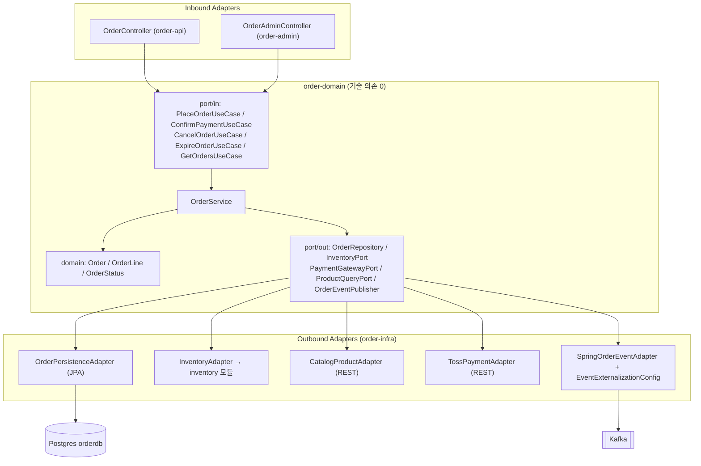
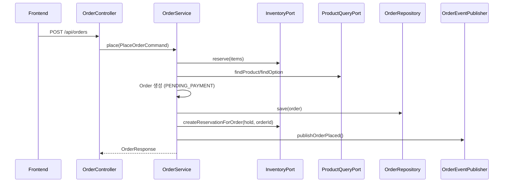
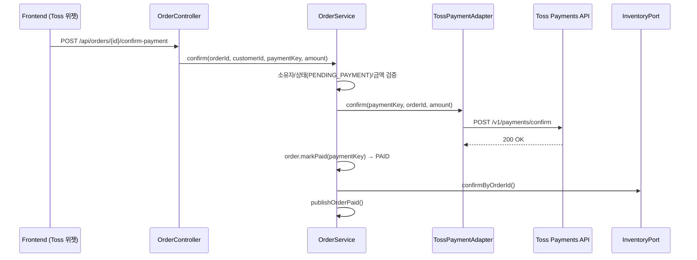
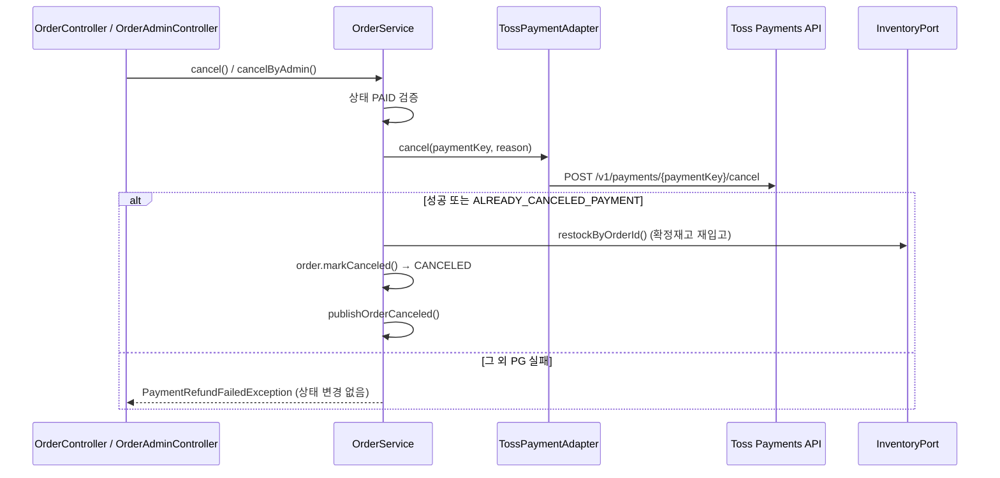

# order — 주문 도메인

주문 생성, 결제(Toss Payments) 승인, 주문취소+환불, 재고 예약 연동을 담당하는 헥사고날 아키텍처 도메인입니다. 6개 Gradle 서브모듈로 구성되며, 상위 설계 원칙은 [../doc/ARCHITECTURE.md](../doc/ARCHITECTURE.md)를 따릅니다.

> 레이어 다이어그램과 시퀀스 다이어그램(마크다운으로 표현이 어려운 상세 흐름)은 **[doc/architecture.html](doc/architecture.html)**에서 확인하세요. 아래 문서에도 핵심 다이어그램을 mermaid로 임베드했습니다.

## 서브모듈

| 모듈 | 배포 단위 | 역할 | 의존 |
|---|---|---|---|
| `order-events` | 라이브러리 | Kafka 이벤트 계약(`OrderPlacedEvent`/`OrderPaidEvent`/`OrderCanceledEvent` record). 구독자(shop-api notification)가 order 구현 대신 이 모듈만 의존한다(GH #5) | 없음(의존성 0) |
| `order-domain` | 라이브러리 | 순수 도메인(`Order`, `OrderLine`, `OrderStatus`) + 유즈케이스 포트(`port/in`, `port/out`). 기술 의존 없음(spring-context/tx만) | `shared-core` |
| `order-infra` | 라이브러리 | 아웃바운드 어댑터: JPA 영속성, catalog REST 클라이언트, Toss 결제 클라이언트, Kafka 이벤트 아웃박스 라우팅 | `order-events`, `order-domain`, `inventory`, `shared-core` |
| `order-api` | BOOT (고객용) | `OrderController` — 주문 생성/조회/결제승인/취소 | `order-domain`, `order-infra`, `inventory`, `shared-web` |
| `order-admin` | BOOT (관리자용) | `OrderAdminController` — 주문 목록/상태변경/관리자 취소(환불 포함) | `order-domain`, `order-infra`, `inventory`, `shared-web` |
| `order-batch` | BOOT (배치, 웹 없음) | `IncompleteEventSweeper`(미발행 이벤트 재시도), 재고만료 이벤트 리스너 활성화 | `order-domain`, `order-infra`, `inventory` |

## 헥사고날 레이어



전체 화면은 [doc/architecture.html](doc/architecture.html#1-레이어--모듈-배치)에서 확대해 볼 수 있습니다.

## 핵심 유즈케이스 흐름

### 1) 주문 생성



실패 시 `InventoryPort.release(hold)`로 예약을 롤백합니다.

### 2) 결제 승인 (Toss confirm)



### 3) 주문취소 + 환불 (PAID → CANCELED)



환불 성공 후 재입고/저장이 실패해도 결제는 이미 취소된 상태이므로, 동일 취소 API를 재호출하면 Toss가 `ALREADY_CANCELED_PAYMENT`를 반환해 로컬 상태 전이만 재시도되어 수렴합니다.

## 이벤트 아웃박스 & Kafka 라우팅

주문 도메인은 `OrderPlacedEvent` / `OrderPaidEvent` / `OrderCanceledEvent` 3종의 이벤트를 발행합니다(계약 모듈 `order-events`가 소유하는 record 타입, 의존성 0 — 구독자는 이 모듈만 컴파일 의존).

1. `SpringOrderEventAdapter`가 `ApplicationEventPublisher.publishEvent()`로 발행
2. Spring Modulith가 같은 트랜잭션 내에서 `event_publication` 테이블(아웃박스)에 기록
3. 커밋 후 `EventExternalizationConfig`(order-infra)가 `order.placed` / `order.paid` / `order.canceled` Kafka 토픽으로 라우팅(키: `orderId`)
4. `shop-api`의 `OrderEventKafkaConsumer`(groupId: `notification`)가 구독 → `NotificationService`가 `(orderId, type)` 기준 멱등 처리 후 알림 생성
5. 발행 실패분은 `order-batch`의 `IncompleteEventSweeper`가 5분 주기로 `IncompleteEventPublications.resubmitIncompletePublicationsOlderThan()` 재시도(ShedLock으로 replica 중복 실행 방지)

재고 만료는 별도 흐름으로, `inventory` 모듈이 발행하는 `ReservationExpiredEvent`를 `ReservationExpiredEventListener`(order-infra, `@ApplicationModuleListener`)가 수신해 `ExpireOrderUseCase.expire()`를 호출합니다(`order-batch`에서만 활성화).

## DB 스키마 (`orderdb`, Flyway — `order-api` 소유)

| 테이블 | 설명 |
|---|---|
| `orders` | 주문 애그리거트. `status` CHECK(`PENDING_PAYMENT`/`PAID`/`PAYMENT_FAILED`/`EXPIRED`/`CANCELED`/`SHIPPED`/`DELIVERED`), `payment_key`(V2), `total_amount`, 배송지 컬럼 |
| `order_lines` | 주문 라인 항목(상품/옵션/수량/단가), `orders` FK |
| `inventory_reservations` | 재고 예약(`inventory` 모듈 소유, orderdb에 함께 영속화). `status` CHECK(`RESERVED`/`CONFIRMED`/`RELEASED`/`EXPIRED`/`RESTOCKED`(V3)) |
| `inventory_reservation_lines` | 예약 라인 항목 |
| `event_publication` | Spring Modulith 이벤트 아웃박스(`event_type`, `publication_date`, `completion_date`, `serialized_event`) |

`order-admin`/`order-batch`는 Flyway를 `validate`로만 사용하며 마이그레이션은 `order-api`가 단독 소유합니다.

## 로컬 실행 / 테스트

```bash
./gradlew :order:order-api:bootRun
./gradlew :order:order-admin:bootRun
./gradlew :order:order-batch:bootRun

./gradlew :order:order-domain:test   # 도메인 단위 테스트 (ArchUnit 포함 예정)
./gradlew :order:order-api:test
```

## k8s 배포

`order-api`(:8081), `order-admin`(:8082), `order-batch`(별도 Deployment, 웹 포트 없음)로 각각 배포됩니다. Ingress는 `/api/admin/orders`→`order-admin`, `/api/orders`→`order-api`로 라우팅합니다. 환경변수 계약(`TOSS_SECRET_KEY` 등)은 [../doc/CONFIGURATION.md](../doc/CONFIGURATION.md)를 참고하세요.
