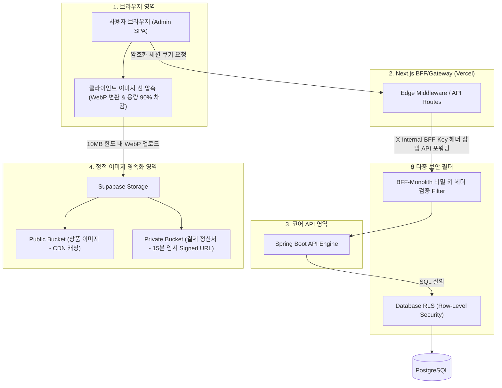

# 🛒 Mini-Commerce 시스템 종합 설계서 (v10.0)
> **Phase 1: 요구사항 정의 ➡️ Phase 2: 아키텍처 설계 ➡️ Phase 3: 구현방법 설계**

본 설계서는 검토된 아키텍처 다이어그램을 바탕으로, 초기 **Modular Monolith** 구조에서 출발하여 향후 **MSA(Microservices Architecture)**로 유연하게 확장할 수 있는 이커머스 시스템의 종합 설계 방안을 다룹니다.

---

## 📌 Phase 1. 요구사항 정의 (Requirements Definition)

초기 시스템은 **핵심 도메인의 핵심 기능(MVP)**을 신속하게 안정적으로 구축하는 것을 목표로 합니다. 도메인을 **핵심(Core) 도메인**과 **지원(Supporting) 도메인**으로 구분하여 스코프를 정의합니다.

### 1. 핵심 도메인 (Core Domain)
*   **Catalog (상품 & 재고 노출)**: 상품 목록 및 상세 정보 제공, 실시간 재고 노출.
*   **Order (주문 & 결제 처리)**: 주문 생성 및 상태 관리, Mock 결제 처리, 결제 실패 시 보상 트랜잭션(재고 복구).
*   **Identity (인증 & 사용자)**: Google OAuth 기반 간편 로그인, 일반 사용자/관리자 권한 제어.

### 2. 지원 도메인 (Supporting Domain)
*   **Inventory (재고 예약 & 정합성 제어)**: 핫딜 상품 등 초고동시성 환경에서의 초과 판매 방지.
*   **Notification (알림 송신)**: 주문 상태 변경 시 비동기로 이메일/SMS 알림 발송.

---

## 🗺️ Phase 2. 아키텍처 설계 (Architecture Design)

> **"도메인 경계는 MSA처럼, 운영은 모노리스처럼"**

---

### 🔍 [의사결정 1] 도메인별 선택적 헥사고날 아키텍처 (Hexagonal Architecture) 적용 여부
*   **💡 아키텍쳐 최종 결정 (Pragmatic Hybrid Approach)**
    *   **Order(주문)** 도메인: 결제, 재고, 알림 등 외부 결합도가 높고 정책이 복잡하므로 **헥사고날 아키텍처** 적용.
    *   **Catalog(상품), Identity(인증)** 도메인: 단순 입출력 중심이므로 가벼운 **Layered 구조** 적용.

---

### 🔍 [의사결정 2] 동시성 제어: Redis Lua Script vs Redisson Distributed Lock
*   **💡 동시성 제어 최종 결정**
    *   JPA 기반 비즈니스 로직과 데이터의 완벽한 일관성(ACID) 관리를 위해, DB 트랜잭션을 완전히 감싸 고유 정합성을 유지하기 매우 유리한 **`Redisson Distributed Lock`**을 채택합니다.

---

### 🔍 [의사결정 3] 사용자 인증 방식: BFF 패턴 vs 단순 Token 검증 방식
*   **💡 인증 방식 최종 결정**
    *   브라우저 해킹(XSS) 공격에 원천 면역력을 갖기 위해 Next.js 웹 서버를 Proxy 겸 세션/쿠키 게이트웨이로 활용하는 **`BFF (Backend-For-Frontend) 패턴`**을 도입합니다.

---

### 🔍 [의사결정 4] 이벤트 정합성 및 MSA Kafka 점진적 스위칭 전략
*   **💡 이벤트 정합성 최종 결정 (Spring Modulith)**
    *   DB 트랜잭션과 동일 묶음으로 이벤트를 보관하는 **`Spring Modulith Event Publication Registry`** (자동 Outbox 패턴)를 활용해 100% 이벤트 수신을 보장합니다.

---

### 🔍 [의사결정 5] API Gateway/BFF 구현 구체적 기술 스택
*   **💡 API Gateway / BFF 최종 결정: Next.js API Routes & Edge Middleware**
    *   Next.js API Routes & Edge Middleware를 사용하여 인증, 인프라 비용 절감 및 W3C 표준 `traceparent` (Trace ID) 헤더 전파를 통제합니다.

---

### 🔍 [의사결정 6] 횡단 관심사(Cross-Cutting Concerns) 및 관측성(Observability) 처리
*   **💡 트레이싱 기술 최종 결정: Micrometer Tracing**
    *   비동기 컨텍스트 유실(ThreadLocal) 한계를 완벽히 극복하고 W3C 표준과 OpenTelemetry(OTel) 연동을 통한 최상의 분산 트레이싱을 위해 **스프링 부트 3 표준인 Micrometer Tracing**을 채택합니다.

---

### 🔍 [의사결정 7] Java 21 가상 스레드(Virtual Threads) 도입 및 3대 장애 방어 전략
*   **💡 성능 기술 최종 결정: 가상 스레드(Virtual Threads) 활성화**
    *   OS 물리 스레드 리소스 낭비를 방지하고, I/O 블로킹 동시 요청을 수만 건 이상 처리하기 위해 가상 스레드를 활성화하고 **스레드 피닝 방지, HikariCP 커넥션 풀 고사 제어** 설계를 반영합니다.

---

### 🔍 [의사결정 8] 하이브리드 서버리스 인프라 채택 및 평생 $0 비용 운영 전략
*   **💡 인프라 기술 최종 결정: Next.js(Vercel) + Supabase(PostgreSQL/Auth) + Upstash(Redis)**
    *   Vercel, Supabase, Upstash 연동 및 UptimeRobot을 통한 상시 응답 보장 등 하이브리드 서버리스 비용 제로 인프라 전략을 확정합니다.

---

### 🔍 [의사결정 9] 정적 이미지 서빙 최적화 및 다중 레이어 보안 체계 (개정)

이커머스 플랫폼의 자산인 **상품 이미지의 효율적 전달**과 **악성 업로드 방어**, 그리고 **다중 레이어 기반 보안(Multi-Layer Security)**을 구축하기 위한 세부 리소스/보안 설계입니다.



#### A. 정적 리소스 (이미지) 아키텍처 및 서빙 전략
1.  **Public vs Private Bucket 격리 이원화**:
    *   `Public Bucket (상품 이미지)`: 익명의 일반 쇼핑객도 초고속 조회할 수 있도록 퍼블릭 CDN 및 브라우저 캐싱을 적극 적용합니다.
    *   `Private Bucket (정산서, 결제 영수증 등)`: 외부 비인가 노출을 막기 위해 RLS 권한이 있는 소유자만 접근하게 통제하며, 임시 서명된 URL(Signed URL)을 발급합니다.
2.  **2단계 이미지 최적화 및 10MB 원본 사양 상향**:
    *   *상향 이유*: 최근 스마트폰 카메라 성능의 향상으로 고화질 원본 상품 사진이 2MB를 쉽게 초과합니다. 관리자가 리사이징 도구 없이 직관적으로 원본을 업로드할 수 있도록 **최대 업로드 제한 한도를 10MB로 넉넉하게 완화**합니다.
    *   *1단계 최적화 (클라이언트 사전 압축)*: 관리자 화면(Admin SPA)에서 업로드 이벤트가 발생하면, 브라우저 메모리 상에서 자바스크립트 라이브러리(Canvas API 또는 `browser-image-compression` 등)를 통해 고해상도 해상도를 보존하면서 WebP 무손실 포맷으로 사전 인코딩 압축을 수행합니다. 이를 통해 **10MB 원본 파일을 200KB~500KB 수준으로 네트워크 탑재 전 선제 다이어트**하여 서버 전송 시간 및 Supabase 무료 스토리지 한도를 극적으로 보존합니다.
    *   *2단계 최적화 (서버 단 서빙 변환)*: 브라우저가 최종 이미지를 서빙받을 때는 Supabase Image Transformation 기술을 활용하여 디바이스 크기(모바일/태블릿/PC)에 최적화된 리사이징 쿼리스트링 파라미터를 추가해 전달받음으로써 데이터 전송(Egress Bandwidth)을 극소화합니다.
3.  **웹쉘(WebShell) 악성 업로드 방어**:
    *   Supabase Storage 업로드 정책에서 허용 확장자 화이트리스트(`jpg, jpeg, png, webp`만 허용), Content-Type 검증 및 업로드 최대 크기 10MB 제한을 강제하여 웹쉘 스크립트 실행 공격을 원천 방어합니다.

#### B. API 및 데이터베이스 다중 보안 가드
1.  **CORS & BFF-백엔드 간 비밀 키 검증 (BFF Tunneling)**: Next.js BFF와 스프링 백엔드 간에만 사전에 정의된 **비공개 공유 키(`X-Internal-BFF-Key: <SecretKey>`)** 헤더 검증 필터를 구성합니다. 
2.  **데이터베이스 행 레벨 보안 (RLS - Row-Level Security) 강제**: 모든 Supabase PostgreSQL 테이블에 RLS를 의무 활성화하고, 주문 테이블의 경우 `auth.uid() = user_id` 조건문 검증을 적용해 타인의 데이터 조회를 데이터베이스 레벨에서 원천 차단합니다.

---

## 🛠️ Phase 3. 구현방법 설계 (Implementation Design)

### 1. 패키지 구조 설계 (Selective Hexagonal & Layered Hybrid)

```text
backend/src/main/java/com/minicommerce/
├── MiniCommerceApplication.java
│
├── global/                        # [💡 Shared] 공통/횡단 관심사 모듈 (도메인 비즈니스 지식 ZERO)
│   ├── logging/                   # Logback 설정 및 관측성(Observability) 커스텀 메트릭
│   ├── exception/                 # RestControllerAdvice (RFC 7807 기반 글로벌 예외)
│   ├── config/                    # Redisson Config, Spring Modulith Config
│   └── security/                  # BFF 쿠키/헤더 해석, X-Internal-BFF-Key 필터
```

---

## 🎯 Phase별 성공 기준 (Verification & Test Goals)

| 단계 | 검증 시나리오 | 검증 방법 |
| :--- | :--- | :--- |
| **요구사항 정의** | 스프링 모듈리스, Next.js BFF, Java 21, 서버리스 및 10MB 이미지 최적화 다중 보안 합의 완료 | 설계 문서 합의 및 확정 |
| **아키텍처 설계** | 모듈 간 간접 ID 참조 및 헥사고날 의존성 규칙 검증 | `ArchUnit` 테스트 코드 및 Spring Modulith `ApplicationModules` 구조 검증 |
| **구현방법 설계** | 가상 스레드 1,000건 동시 주문, Trace ID 전파 및 BFF 터널링 차단 검증 | `MockMvc` 테스트를 활용하여 `X-Internal-BFF-Key`가 누락된 요청이 차단되는지 및 RLS 조건 오동작 시 타인 주문 조회가 차단되는지 검증 |
